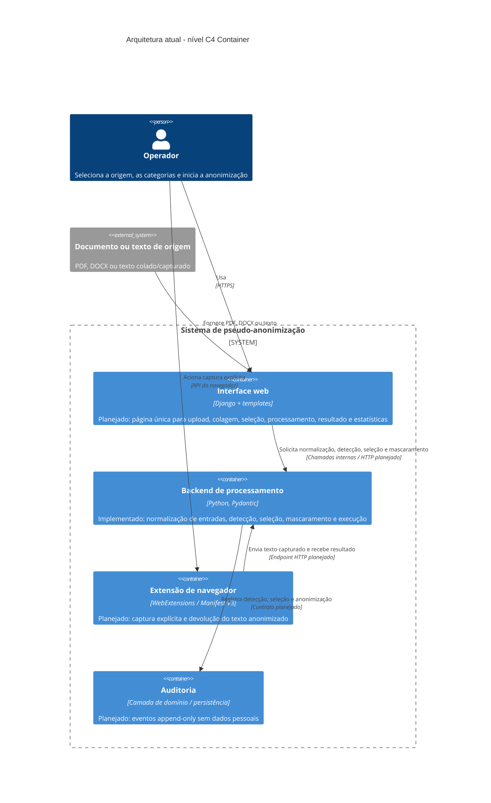
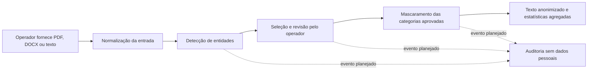

# Arquitetura do sistema

## Resumo

O projeto implementa uma ferramenta Python para pseudo-anonimização de textos jurídicos e administrativos. O fluxo de domínio normaliza entradas de PDF, DOCX, texto colado ou texto capturado por extensão, detecta entidades pessoais e sensíveis, permite selecionar categorias e aplica marcadores tipados ao resultado.

A implementação atual está concentrada em `src/backend/`. Os módulos são uma biblioteca de processamento, ainda sem uma aplicação Django, endpoints HTTP, telas web, persistência de auditoria ou extensão de navegador implementados. A interface web e a extensão fazem parte da arquitetura aprovada e aparecem neste documento como componentes planejados.

A separação principal de responsabilidades é:

1. **Entrada multicanal:** valida e normaliza PDF, DOCX, texto e extensão no contrato `DocumentoOrigem`.
2. **Catálogo e detecção:** mantém categorias canônicas e produz entidades com tipo, offsets, confiança, origem e identificador.
3. **Seleção:** representa as categorias escolhidas pelo operador antes do mascaramento.
4. **Mascaramento:** atribui índices estáveis, valida sobreposições e gera texto UTF-8 com marcadores `prefixo + índice`.
5. **Execução:** associa uma operação a uma origem e às categorias selecionadas, mantendo o texto em memória durante o fluxo previsto.
6. **Interface e integração:** camada web Django e extensão de navegador previstas, mas ainda não implementadas.

## Diagrama C4 de containers

O diagrama abaixo representa o estado arquitetural atual. Containers marcados como **planejado** são contratos aprovados nas ADRs, mas ainda não possuem implementação funcional no repositório.

### Leitura do diagrama

- O **backend de processamento** é o único container funcional representado pelo código atual. Ele não deve enviar documentos a serviços externos sem autorização explícita.
- A **interface web** é o ponto de interação definido para a próxima camada da aplicação. Seu fluxo deve exigir uma ação explícita do operador antes do processamento.
- A **extensão de navegador** deve capturar somente a caixa de texto escolhida pelo operador e reutilizar os mesmos contratos de entrada, seleção e mascaramento.
- A **auditoria** é uma responsabilidade arquitetural aprovada, mas a persistência append-only ainda não está presente na árvore atual de código.
- O documento de origem é tratado como entrada confidencial. O resultado público do fluxo é texto anonimizado, sem mapa de reidentificação embutido.

## Containers e módulos atuais

### Backend de processamento

O container de backend é implementado como módulos Python sob `src/backend/`:

| Responsabilidade | Módulos principais | Papel |
| --- | --- | --- |
| Entrada multicanal | `entrada_multicanal.py`, `pdf_extraction.py`, `pdf_binary_extraction.py` | Valida PDF, extrai texto pesquisável, lê DOCX e cria entradas de texto ou extensão. |
| Catálogo | `categorias.py` | Define categorias canônicas, prefixos e categorias customizadas. |
| Detecção | `deteccao.py`, `deteccao_tdd.py`, `regras_deteccao.py` | Detecta entidades, aplica limiares de confiança e produz offsets e identificadores. |
| Seleção | `selecao.py` | Representa categorias selecionadas e a configuração do operador. |
| Mascaramento | `mascaramento.py` | Atribui índices, rejeita sobreposições inválidas e substitui entidades por marcadores. |
| Execução | `execucao.py` | Identifica a origem e as categorias de uma execução e retém temporariamente o texto de origem. |
| Configuração | `settings.py` | Mantém limites de processamento atualmente definidos. |

O backend usa `DocumentoOrigem` como contrato normalizado entre canais. Os offsets de entidades seguem o intervalo `[início, fim)`. O mascaramento preserva segmentos do texto e aplica as substituições sobre entidades selecionadas, mantendo entidades não selecionadas no resultado.

### Interface web

A interface web está prevista como uma aplicação Django integrada ao backend, conforme as ADRs 0001 e 0003. A página deverá oferecer:

- upload de PDF ou DOCX;
- campo para colagem ou entrada de texto;
- seleção explícita de tipos como `NOME`, `ENDERECO`, `EMAIL`, `RG`, `CPF`, passaporte, outros documentos e categorias sensíveis;
- botão de início do processamento;
- resultado anonimizado e mensagens de erro acionáveis;
- estatísticas agregadas, como palavras, tokens estimados, termos anonimizados e tempo de processamento.

No estado atual, `src/frontend/` ainda não contém views, templates, rotas ou configurações Django. Portanto, a interface não deve ser tratada como disponível em produção.

### Extensão de navegador

A extensão está prevista em `src/extension/` para uma futura implementação WebExtensions com Manifest V3. Ela deverá depender de ação explícita do operador, solicitar permissões mínimas e enviar somente o texto da caixa escolhida para o fluxo autorizado. O diretório atual ainda não contém manifesto, scripts ou integração HTTP.

### Auditoria

A arquitetura prevê eventos para detecção, seleção, anonimização e exportação, sem texto bruto ou valores originais. A auditoria deverá ser íntegra e não editável pela interface padrão. Não há, no estado atual, um módulo de auditoria persistente ou modelo `EventoAuditoria` implementado; essa responsabilidade permanece um item de evolução arquitetural.

## Fluxo principal

1. A entrada é validada e convertida para `DocumentoOrigem`.
2. O detector identifica entidades com offsets, confiança, origem e tipo canônico.
3. O operador escolhe as categorias e, quando necessário, revisa as detecções.
4. O mascaramento processa apenas entidades aprovadas, sem substituir categorias não selecionadas.
5. O sistema produz texto anonimizado e métricas agregadas, sem incluir valores originais.
6. Em uma evolução posterior, as etapas relevantes gerarão eventos de auditoria sanitizados.

## Fronteiras e decisões arquiteturais

- **Privacidade:** documentos e textos são confidenciais; nenhum conteúdo original deve aparecer em logs, erros, estatísticas ou auditoria.
- **Detecção separada de mascaramento:** o operador deve poder rejeitar detecções ou desmarcar categorias antes da substituição.
- **Processamento local por padrão:** modelos remotos e serviços externos não fazem parte do fluxo padrão.
- **OCR:** não é habilitado implicitamente para PDFs sem camada textual utilizável.
- **Extensibilidade:** novas categorias entram pelo catálogo, sem exigir alteração do fluxo principal.
- **Interface única:** PDF, DOCX e texto devem convergir para o mesmo fluxo de seleção e processamento.

## Lacunas conhecidas e próximos passos

1. Criar a aplicação Django, suas rotas, templates e controles de upload.
2. Expor o backend por um contrato HTTP validado, sem duplicar regras no frontend.
3. Implementar estatísticas agregadas e definir o tokenizer usado na estimativa de tokens.
4. Implementar auditoria append-only e validar a sanitização antes da persistência.
5. Implementar a extensão de navegador com permissões mínimas e ação explícita.
6. Adicionar testes de integração para a interface, os canais de entrada, auditoria e extensão.
7. Atualizar este documento quando a arquitetura planejada deixar de ser apenas contratual.

## Referências

- [ADR 0001 — Stack Python, Pydantic, spaCy, pypdf e Django](adr/0001-stack-python-pydantic-spacy-django.md)
- [ADR 0002 — DOCX, texto/clipboard, extensão e auditoria](adr/0002-ampliar-escopo-docx-extensao-auditoria.md)
- [ADR 0003 — Interface web simples](adr/0003-interface-web-anonimizacao-documentos.md)
- [Requisitos funcionais](requisitos/requisitos-funcionais.md)
- [Catálogo de entidades](requisitos/catalogo-entidades.md)
- [Especificação 006 — Seleção de categorias](especificacoes/006-selecao-categorias-operador/spec.md)
